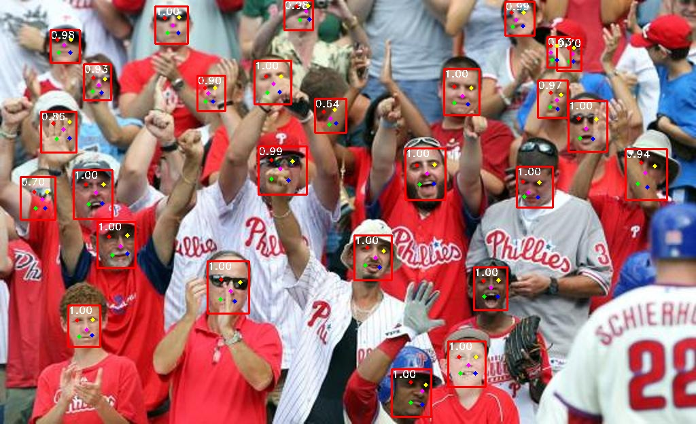
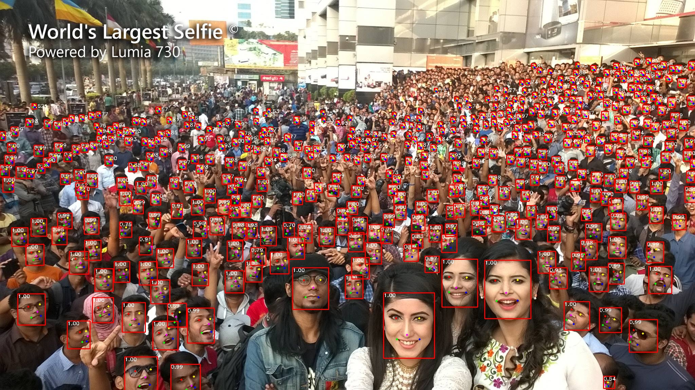

# 📸 Tiny-Face: Ultra-lightweight Face Detection

[](https://github.com/yakhyo/tiny-face-pytorch/releases)
[](https://github.com/yakhyo/tiny-face-pytorch/stargazers)
[](https://github.com/yakhyo/tiny-face-pytorch)
[](https://github.com/yakhyo/tiny-face-pytorch/blob/main/LICENSE)

<video controls autoplay loop src="https://github.com/user-attachments/assets/faf65b91-db76-4538-beca-87fc65566e51" muted="false" width="100%"></video>

Tiny-Face is an ultra-lightweight face detection model optimized for mobile and edge devices. Built upon the concepts of RetinaFace, this model achieves high precision and speed in face detection with minimal resource requirements.

> **Note**  
> This repository refines lightweight architectures like RetinaFace (mobile), Slim and RFB with a focus on Tiny-level efficiency.

<div align="center">

</div>

## 📈 Performance on WiderFace

### Multi-scale Image Size

| Models     | Pretrained on ImageNet | Easy   | Medium | Hard   | #Params(M) | Size(MB) |
| ---------- | ---------------------- | ------ | ------ | ------ | ---------- | -------- |
| SlimFace   | False                  | 79.50% | 79.40% | 68.36% | 0.343      | 1.4      |
| RFB        | False                  | 80.49% | 81.51% | 75.73% | 0.359      | 1.5      |
| RetinaFace | True                   | 87.69% | 86.39% | 80.21% | 0.426      | 1.8      |

### Original Image Size

| Models     | Pretrained on ImageNet | Easy   | Medium | Hard   | #Params(M) |
| ---------- | ---------------------- | ------ | ------ | ------ | ---------- |
| SlimFace   | False                  | 87.10% | 84.36% | 67.38% | 0.343      |
| RFB        | False                  | 87.09% | 84.61% | 69.22% | 0.359      |
| RetinaFace | True                   | 90.26% | 87.48% | 72.85% | 0.426      |

## ✨ Features

- **Tiny-sized Efficiency**: Ultra-lightweight and optimized for low-resource devices.
- **Mobile-friendly**: Includes Slim, RFB, and MobileNetV1_0.25 configurations.
- **Pretrained Backbones**: Models suitable for mobile and embedded systems.

### Download model weights

All weights are available in [GitHub release v0.0.1](https://github.com/yakhyo/tiny-face-pytorch/releases/tag/v0.0.1).

| Models     | PyTorch Weights                                                                                       | ONNX Weights                                                                                            | Input Size |
| ---------- | ----------------------------------------------------------------------------------------------------- | ------------------------------------------------------------------------------------------------------- | ---------- |
| SlimFace   | [slimface.pth](https://github.com/yakhyo/tiny-face-pytorch/releases/download/v0.0.1/slim.pth)         | [slimface.onnx](https://github.com/yakhyo/tiny-face-pytorch/releases/download/v0.0.1/slim.onnx)         | 640x640    |
| RFB        | [rfb.pth](https://github.com/yakhyo/tiny-face-pytorch/releases/download/v0.0.1/rfb.pth)               | [rfb.onnx](https://github.com/yakhyo/tiny-face-pytorch/releases/download/v0.0.1/rfb.onnx)               | 640x640    |
| RetinaFace | [retinaface.pth](https://github.com/yakhyo/tiny-face-pytorch/releases/download/v0.0.1/retinaface.pth) | [retinaface.onnx](https://github.com/yakhyo/tiny-face-pytorch/releases/download/v0.0.1/retinaface.onnx) | 640x640    |

## ⚙️ Installation

1. Clone the repository:

   ```bash
   git clone https://github.com/yakhyo/tiny-face-pytorch.git
   cd tiny-face-pytorch
   ```

2. Install dependencies:
   ```bash
   pip install -r requirements.txt
   ```

## 📂 Dataset Setup

1. **Download the Dataset**:

   - Download the [WIDERFACE](http://shuoyang1213.me/WIDERFACE/WiderFace_Results.html) dataset.
   - Download annotations (face bounding boxes & five facial landmarks) from [Baidu Cloud](https://pan.baidu.com/s/1Laby0EctfuJGgGMgRRgykA) (password: `fstq`) or [Dropbox](https://www.dropbox.com/s/7j70r3eeepe4r2g/retinaface_gt_v1.1.zip?dl=0).

2. **Organize the Dataset Directory**:

   Structure your dataset directory as follows:

   ```
   data/
   └── widerface/
      ├── train/
      │   ├── images/
      │   └── label.txt
      └── val/
         ├── images/
         └── wider_val.txt
   ```

> [!NOTE]  
> `wider_val.txt` only includes val file names but not label information.

There is also an organized dataset (as shown above): Link from [Google Drive](https://drive.google.com/open?id=11UGV3nbVv1x9IC--_tK3Uxf7hA6rlbsS) or [Baidu Cloud](https://pan.baidu.com/s/1jIp9t30oYivrAvrgUgIoLQ) _(password: ruck)_. Thanks to [biubug6](https://github.com/biubug6) for the organized dataset.

## 🏋️‍♂️ Training

To train a model, specify the network backbone:

```bash
python train.py --network slim  # Replace 'slim' with your choice of model
```

**Available Models**:

- `retinaface`
- `slim`
- `rfb`

### 📊 Inference

Inference the model using:

```bash
python detect.py --network retinaface --weights weights/retinaface.pth
                           slim                 weights/slim.pth
                           rfb                  weights/rfb.pth
```

#### Model found following number of faces from large selfi image:

- **RetinaFace**: 459
- **RFB**: 430
- **Slim**: 384
<div align="center">

<p>RetinaFace model inference result.</p>
</div>

## 🧪 Evaluating RetinaFace on WiderFace Dataset

### 1. Get and Install WiderFace Evaluation Tool

1. Clone the WiderFace evaluation repository inside the `tiny-face-pytorch` folder:
   ```bash
   git clone https://github.com/yakhyo/widerface_evaluation
   ```
2. Navigate to the `widerface_evaluation` folder and build the required extension:
   ```bash
   cd widerface_evaluation
   python3 setup.py build_ext --inplace
   ```
3. Return to the `tiny-face-pytorch` folder after installation is complete:
   ```bash
   cd ..
   ```

### 2. Generate Predictions

Run the following command to evaluate your model with WiderFace, specifying the model architecture (`mobilenetv1_0.25` in this example) and the path to the trained weights. Predictions will be stored in `widerface_txt` inside the `widerface_evaluation` folder.

```bash
python evaluate_widerface.py --network retinaface --weights weights/retinaface.pth
                                       slim                 weights/slim.pth
                                       rfb                  weights/rfb.pth
```

### 3. Run the Final Evaluation

After generating predictions, navigate to the widerface_evaluation folder and run the following command to compare predictions with the ground truth annotations:

```bash
cd widerface_evaluation
python evaluation.py -p widerface_txt -g ground_truth
```

> [!NOTE]  
> Ensure `ground_truth` is the path to the WiderFace ground truth directory.

This will begin the evaluation process of your model on the WiderFace dataset.

## 📜 License

This project is licensed under the MIT License. See the [LICENSE](LICENSE) file for details.

## 🔗 References

- This repo based on https://github.com/yakhyo/retinaface-pytorch
- Slim and RFB model architectures are modified from https://github.com/biubug6/Face-Detector-1MB-with-landmark
